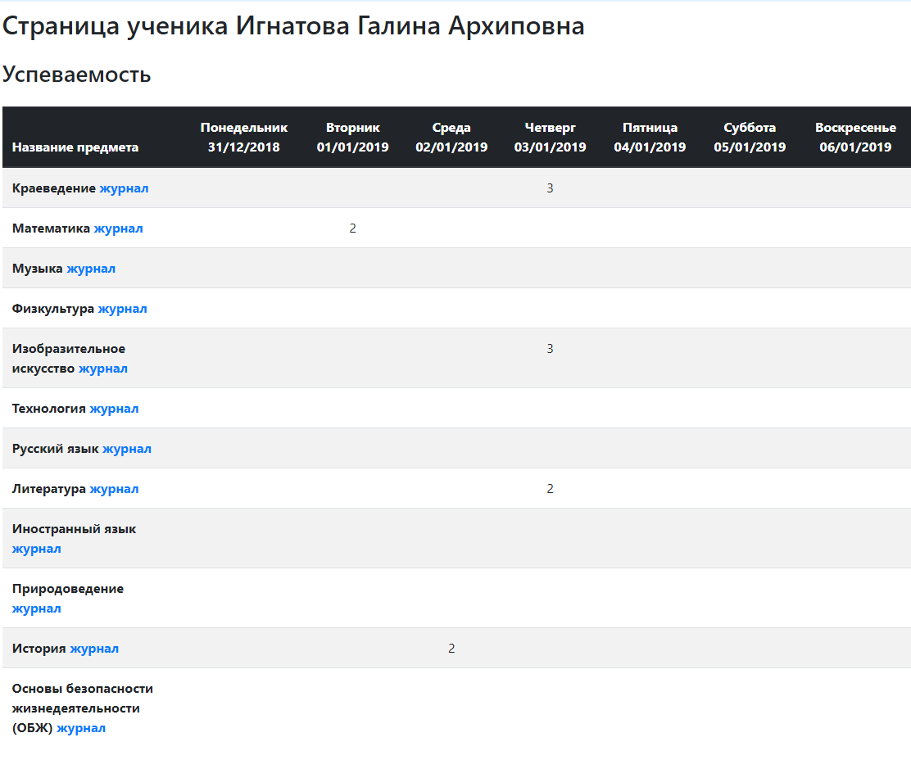
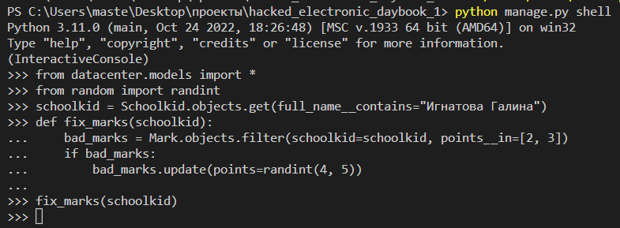
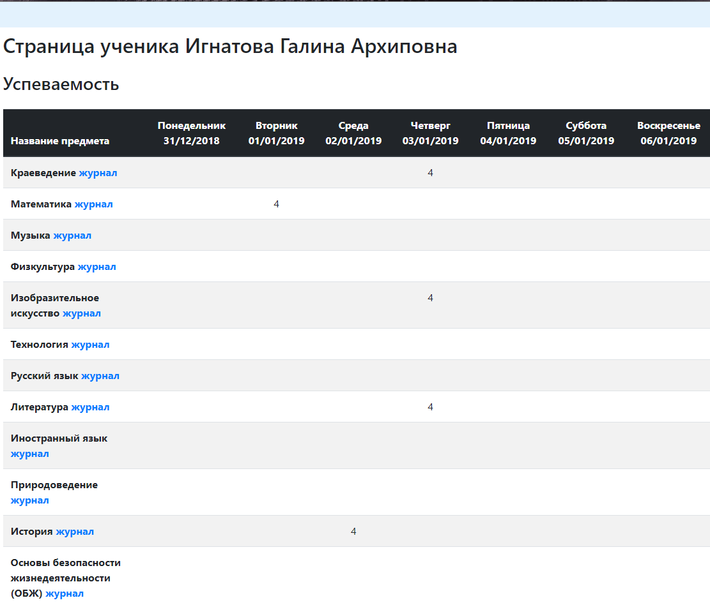

# hacked_electronic_daybook


___
#### Это скрипт который имеет набор функций для изменения значений в базе данных. 
___
### Содержание:
* [Требования](https://github.com/Artuom4ik/hacked_electronic_daybook#%D0%B4%D0%BB%D1%8F-%D0%B7%D0%B0%D0%BF%D1%83%D1%81%D0%BA%D0%B0-%D0%BF%D1%80%D0%BE%D0%B3%D1%80%D0%B0%D0%BC%D0%BC%D1%8B-%D1%82%D1%80%D0%B5%D0%B1%D1%83%D0%B5%D1%82%D1%81%D1%8F)
* [Как пользоваться скриптом](https://github.com/Artuom4ik/hacked_electronic_daybook#%D0%BA%D0%B0%D0%BA-%D0%BF%D0%BE%D0%BB%D1%8C%D0%B7%D0%BE%D0%B2%D0%B0%D1%82%D1%8C%D1%81%D1%8F-%D1%81%D0%BA%D1%80%D0%B8%D0%BF%D1%82%D0%BE%D0%BC)
* [Пример использования](https://github.com/Artuom4ik/hacked_electronic_daybook#%D0%BF%D1%80%D0%B8%D0%BC%D0%B5%D1%80-%D1%80%D0%B0%D0%B1%D0%BE%D1%82%D1%8B-%D1%81%D0%BA%D1%80%D0%B8%D0%BF%D1%82%D0%B0)
* [Описание каждой функции](https://github.com/Artuom4ik/hacked_electronic_daybook#%D0%BE%D0%BF%D0%B8%D1%81%D0%B0%D0%BD%D0%B8%D0%B5-%D0%BA%D0%B0%D0%B6%D0%B4%D0%BE%D0%B9-%D1%84%D1%83%D0%BD%D0%BA%D1%86%D0%B8%D0%B8)
___
>### Для запуска программы требуется:
 * Скачать [Python](https://www.python.org/) версии 3.1 или выше.
 * Операционная система macOS, linux, windows 7 или выше.
___
### Как пользоваться скриптом:
* Запуск Django Shell: 
    * Открываем консоль GitBash либо PowerShell.
    * Записываем в консоль команду для запуска Django Shell:
    ```python manage.py shell```
* В консоль прописываем команды для импортирования всех нужных модулей:
    ```from datacenter.models import *```
    ```from random import randint```
* В консоль записываем команду:
```schoolkid = Schoolkid.objects.get(full_name__contains="Фамилия Имя")```
* Выбираем нужную функцию.
* Копируем её в консоль.
* В консоль пишем команду для запуска функции.
___
### Описание каждой функции:
* ```fix_marks()``` - изменяет плохие отметки на хорошие.
* ```remove_chastisement()``` - удаляет замечания в электронном дневнике.
* ```create_commendation()``` - добавляет похвалу по заданному предмету за последнее пресутствие на нём.
___
### Пример работы скрипта:
#### До




#### После

